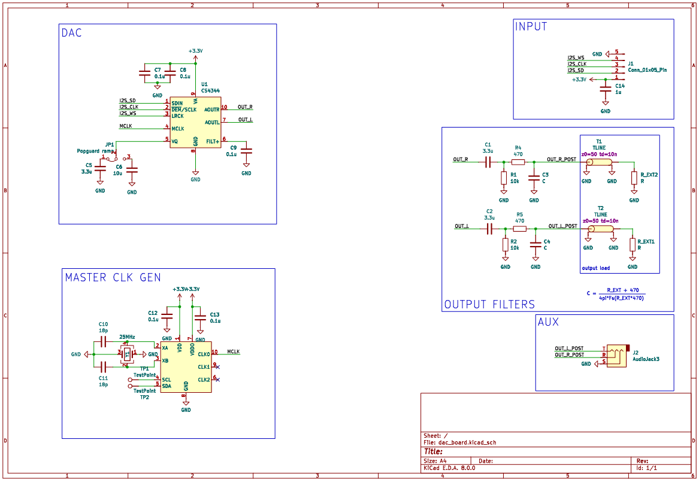

# basic_I2S_DAC
A simple desgin for a I2S DAC with 24bit resolution and 192KHz sampling.

this was desgined to work a longside the [function generator](https://github.com/sirlilpanda/function-generator) as an expansion board for basic testing of I2S and usb audio devices.

